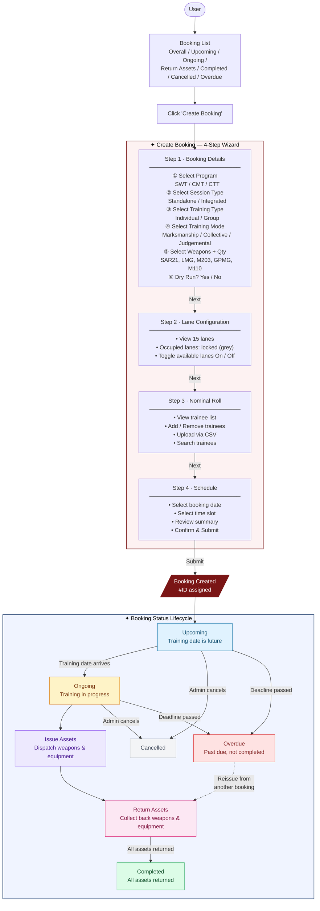

# TRMS Booking Workflow

## Overview Flowchart



---

## Step-by-Step Detail

### Step 1 — Booking Details

| Field | Options |
|---|---|
| Program | SWT · CMT · CTT |
| Session Type | Standalone · Integrated |
| Training Type | Individual · Group |
| Training Mode | Marksmanship · Collective · Judgemental |
| Weapons | SAR21 / LMG / M203 / GPMG / M110 (+ quantity each) |
| Dry Run | Yes · No |

### Step 2 — Lane Configuration

- Total lanes: **15**
- Pre-occupied lanes are **locked** (grey, cannot toggle)
- Available lanes can be toggled **On** (green) or **Off** (red)

### Step 3 — Nominal Roll

- View list of trainees with Rank, Name, NRIC, Platoon, Weapon
- Actions: **Add trainee**, **Upload CSV**, **Search**, **Delete**

### Step 4 — Schedule

- Select **date** (calendar picker)
- Select **time slot** (start → end)
- Review full booking summary
- **Submit** → booking record created with unique ID (e.g. `#260427-BK001`)

---

## Status Lifecycle

```
Upcoming ──────────────────────────────────────────────► Cancelled
   │                                                          ▲
   │ training date                                            │
   ▼                                                          │
Ongoing ──────────────────────────────────────────────────────┘
   │                                                          │
   │ training done                              deadline past─┘
   ▼
Issue Assets
   │
   ▼
Return Assets  ◄──── Reissue from another booking (Overdue path)
   │
   │ all returned
   ▼
Completed
```

| Status | Trigger |
|---|---|
| **Upcoming** | Booking submitted, training date in future |
| **Ongoing** | Training date reached |
| **Issue Assets** | Trainer initiates asset dispatch |
| **Return Assets** | Training session ends, collect equipment |
| **Completed** | All assets confirmed returned |
| **Cancelled** | Admin manually cancels (from Upcoming or Ongoing) |
| **Overdue** | Deadline passed without completion |
